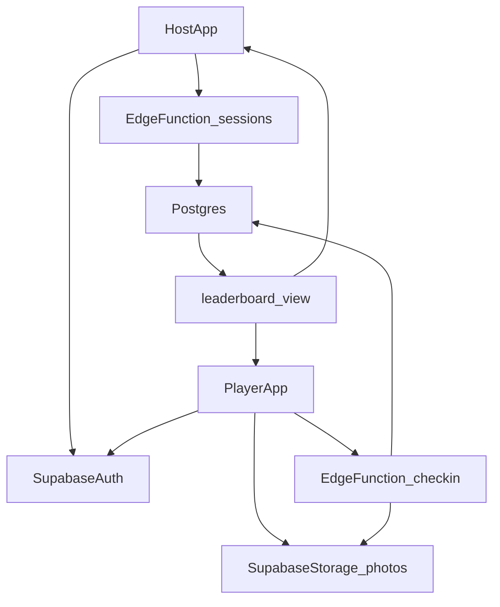

# Pub Race v1 Implementation Plan

## Goals

- Let hosts create race sessions with ordered pub stops and also race as participants.
- Let players join sessions and submit a drink photo per stop.
- Enforce fair timing with server-calculated durations and GPS proximity checks.
- Show a live leaderboard ranked by fastest valid completion times.
- Lock session route data once the host starts the race.

## Recommended Stack

- **Client:** React Native + Expo (iOS/Android from one codebase).
- **Backend:** Supabase Postgres + Auth + Storage + Realtime + Edge Functions.
- **Maps/GPS:** Expo Location (client) + optional reverse geocoding.

## Core Architecture

## Data Model (Supabase)

- `profiles`: `id`, `display_name`, `avatar_url`, `created_at`.
- `sessions`: `id`, `host_user_id`, `name`, `status(draft|live|finished)`, `join_code`, `started_at`, `ended_at`.
- `pub_stops`: `id`, `session_id`, `stop_index`, `name`, `address`, `latitude`, `longitude`, `radius_m`.
- `session_players`: `id`, `session_id`, `user_id`, `role(host|player)`, `joined_at`, `disqualified_at`.
- `checkins`: `id`, `session_id`, `player_id`, `stop_id`, `arrived_at_server`, `photo_path`, `lat`, `lng`, `distance_m`, `is_valid`, `invalid_reason`.
- `player_progress`: materialized/projection table for latest completed stop and total elapsed time.
- `leaderboard_view`: SQL view ranking players by `total_elapsed_seconds`, tie-breaker `last_valid_checkin_at`.

## Security & Fairness Rules

- Use **RLS** so players can only read/write their own check-ins within joined sessions.
- Auto-enroll host into `session_players` on session creation so they appear in race state and rankings.
- Keep timing authoritative on server (`now()` in Edge Function), not client clock.
- Validate check-in location by computing distance from pub coordinates and `radius_m`.
- Require photo upload path to match authenticated user/session naming convention.
- Prevent duplicate completion for same stop/player.
- Disallow insert/update/delete on `pub_stops` when `sessions.status != draft` (route is immutable after start).

## Key Backend Features

- SQL migrations for schema, indexes, constraints, RLS policies.
- `create_session` Edge Function: host defines route, publishes `join_code`, and inserts host as an active racer.
- `join_session` Edge Function: join by code.
- `start_session` Edge Function: atomically flips `sessions.status` to `live`, sets `started_at`, and freezes route edits.
- `submit_checkin` Edge Function: validates stop order + GPS radius, writes authoritative timing.
- Realtime subscriptions on `player_progress`/`checkins` for live leaderboard updates.

## Mobile App Features (v1)

- Auth: email magic link or OAuth.
- Host flow: create session, add/reorder pubs, start race, submit own check-ins, and monitor leaderboard.
- Player flow: join by code, view next pub, capture/upload photo, submit check-in.
- Live leaderboard screen with position changes and elapsed times.
- Session detail timeline showing each stop status and validation outcome.

## v1 vs v2 Scope

- **v1 (in scope):** one required drink per pub stop with photo proof and timed leaderboard.
- **v2 (out of scope for now):** per-stop challenge types (e.g., pint, shot, custom challenge rules).
- Design schema/logic so `pub_stops` can later gain `challenge_type` and `challenge_rules` without breaking v1 flows.

## Suggested Initial File Layout

- [mobile/app/(auth)/login.tsx](<mobile/app/(auth)/login.tsx>)
- [mobile/app/(host)/create-session.tsx](<mobile/app/(host)/create-session.tsx>)
- [mobile/app/(player)/join-session.tsx](<mobile/app/(player)/join-session.tsx>)
- [mobile/app/(race)/leaderboard.tsx](<mobile/app/(race)/leaderboard.tsx>)
- [supabase/migrations/001_initial_schema.sql](supabase/migrations/001_initial_schema.sql)
- [supabase/migrations/002_rls_policies.sql](supabase/migrations/002_rls_policies.sql)
- [supabase/functions/submit_checkin/index.ts](supabase/functions/submit_checkin/index.ts)
- [supabase/functions/create_session/index.ts](supabase/functions/create_session/index.ts)
- [supabase/functions/join_session/index.ts](supabase/functions/join_session/index.ts)

## Milestones

1. **Foundation:** Expo app scaffolding, Supabase auth integration, profile setup.
2. **Session lifecycle:** host create/start session (auto-joined as racer) + players join by code.
3. **Route and check-ins:** ordered pubs (locked after start), photo upload, server-side check-in validation.
4. **Leaderboard:** progress projection + realtime ranking UI.
5. **Hardening:** anti-cheat checks, edge-case handling, QA + seed data.

## Validation & Test Plan

- Unit test stop-order and distance validation logic in Edge Functions.
- Integration test happy path: create session → join → all check-ins → finish ranking.
- Integration test invalid paths: out-of-order stop, outside radius, duplicate check-in.
- Manual mobile test in two devices for realtime ranking latency and consistency.
- Load test target: 100 concurrent players in one session, acceptable leaderboard delay < 2s.
